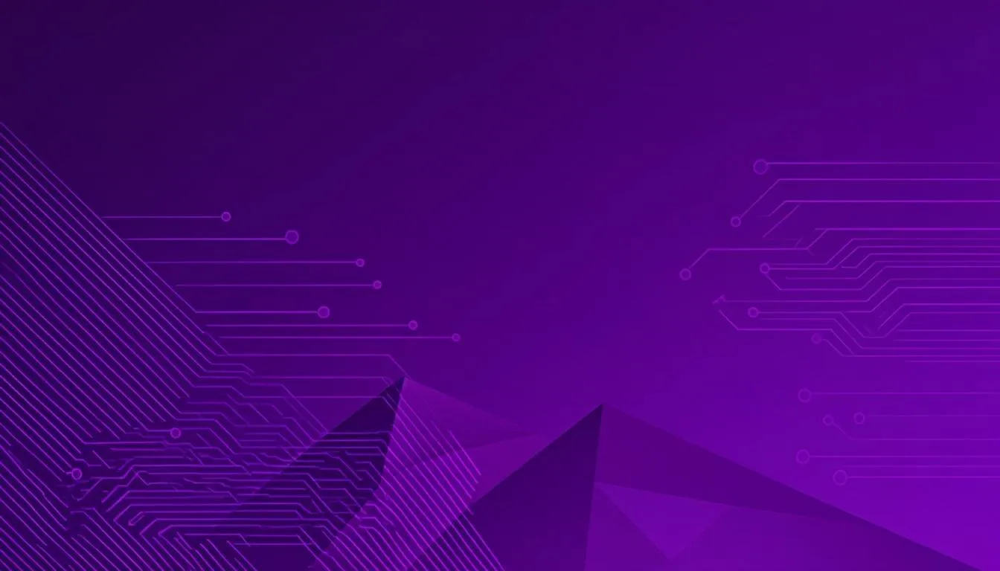

<p align="center">
  
</p>

<h1 align="center">Mahla Zohourparvaz — Portfolio</h1>

<p align="center">
  <strong>Front-End Developer</strong> · React / Next.js / Vue 3 / TypeScript<br/>
  Building scalable enterprise web applications with 2+ years of professional experience.
</p>

<p align="center">
  <a href="https://github.com/mahla-zohourparvaz/portfolio" target="_blank">
    
  </a>
  <a href="https://github.com/mahla-zohourparvaz/portfolio" target="_blank">
    
  </a>
  <a href="https://github.com/mahla-zohourparvaz/portfolio" target="_blank">
    
  </a>
  <a href="https://github.com/mahla-zohourparvaz/portfolio" target="_blank">
    
  </a>
  <a href="https://github.com/mahla-zohourparvaz/portfolio" target="_blank">
    
  </a>
  <a href="https://github.com/mahla-zohourparvaz/portfolio" target="_blank">
    
  </a>
</p>

---

## 🌟 Overview

A modern, production-ready portfolio website showcasing professional experience, 12+ enterprise projects, and a comprehensive tech stack. Built with a focus on performance, accessibility, and visual design.

## ✨ Sections

| Section | Description |
|---------|-------------|
| **Hero** | Animated landing with profile photo, role title, and CTA buttons |
| **About** | Self-introduction with 6 highlight cards (State-Driven Architecture, Multi-Framework Expertise, Security & Observability, SDD Workflow, Healthcare & Enterprise, Real-Time Systems) |
| **Featured Work** | 12 project cards with real screenshots, detail modals, tech stacks, and key features |
| **Experience** | 4 companies with expandable sub-project accordions — PART Software Group, Smart Dentistry, MoshaVeremon, Nextera Factory |
| **Tech Stack** | 10 categorized skill cards covering 60+ technologies with icons |
| **Education** | Academic background |
| **Contact** | Contact form with API integration + social links |
| **Footer** | Sticky footer with quick navigation and social links |

## 🛠 Tech Stack

### Core
- **Framework:** [Next.js 16](https://nextjs.org/) (App Router)
- **Language:** [TypeScript 5](https://www.typescriptlang.org/)
- **Styling:** [Tailwind CSS 4](https://tailwindcss.com/) with OKLCH color system
- **UI Components:** [shadcn/ui](https://ui.shadcn.com/) (New York style)
- **Icons:** [Lucide React](https://lucide.dev/)
- **Animations:** [Framer Motion 12](https://www.framer.com/motion/)

### Design System
- **Dark / Light Mode** via [next-themes](https://github.com/pacocoursey/next-themes)
- **OKLCH-based color system** (hue 290 — purple/violet)
- **Responsive design** — Mobile-first with `sm` / `md` / `lg` / `xl` breakpoints
- **IntersectionObserver** fade-in animations (no scroll event listeners)
- **CSS grid-rows animation** for expandable accordions

### Fonts
- **Body:** [Plus Jakarta Sans](https://fonts.google.com/specimen/Plus+Jakarta+Sans)
- **Code:** [Fira Code](https://fonts.google.com/specimen/Fira+Code)

### Architecture
```
src/
├── app/
│   ├── layout.tsx          # Root layout, fonts, metadata, ThemeProvider
│   ├── page.tsx            # Single-page assembly
│   └── api/
│       └── contact/route.ts # Contact form API
├── components/
│   ├── portfolio/
│   │   ├── hero-section.tsx
│   │   ├── about-section.tsx
│   │   ├── projects-section.tsx   # 12 project cards + dynamic modal
│   │   ├── project-modal.tsx      # Code-split with next/dynamic
│   │   ├── experience-section.tsx # Timeline with expandable sub-projects
│   │   ├── skills-section.tsx     # 10 categorized tech cards
│   │   ├── education-section.tsx
│   │   ├── contact-section.tsx
│   │   ├── navbar.tsx             # Responsive with scroll detection
│   │   ├── footer.tsx             # Sticky bottom
│   │   ├── section-heading.tsx
│   │   ├── fade-in.tsx            # IntersectionObserver-based animation
│   │   └── theme-toggle.tsx
│   └── ui/                        # 40+ shadcn/ui components
├── lib/
│   └── utils.ts
└── prisma/
    └── schema.prisma
```

## 🚀 Getting Started

### Prerequisites
- [Node.js](https://nodejs.org/) 18+ or [Bun](https://bun.sh/)
- [pnpm](https://pnpm.io/) / [npm](https://www.npmjs.com/) / [bun](https://bun.sh/)

### Installation

```bash
# Clone the repository
git clone https://github.com/mahla-zohourparvaz/portfolio.git
cd portfolio

# Install dependencies
bun install

# Run the development server
bun run dev
```

Open [http://localhost:3000](http://localhost:3000) in your browser.

### Available Scripts

| Command | Description |
|---------|-------------|
| `bun run dev` | Start development server (port 3000) |
| `bun run build` | Create production build |
| `bun run start` | Start production server |
| `bun run lint` | Run ESLint |

## 📸 Featured Projects

This portfolio showcases **12 real-world enterprise projects**:

| # | Project | Company | Tech |
|---|---------|---------|------|
| 1 | Web-Signature Platform | PART Software Group | Vue 3, XState, Pinia, Vue Router, SCSS, Axios, Sentry, Vite, PWA |
| 2 | DSS Admin Panel | PART Software Group | Vue 3, Vite, Vue Router, Pinia, Axios, PWA |
| 3 | DSS (Digital Signature System) | PART Software Group | Vue 3, Sass, Pinia |
| 4 | DRI 2717 | Smart Dentistry | Next.js 15, TypeScript, TailwindCSS, Shadcn UI, React Query, Zod |
| 5 | DeventApp Platform | Smart Dentistry | React.js, TypeScript, TailwindCSS, Redux Toolkit, TanStack Query |
| 6 | Devent Admin Panel | Smart Dentistry | React.js, TypeScript, TailwindCSS, Redux Toolkit, TanStack Query |
| 7 | Cloudent | Smart Dentistry | React.js, Redux Toolkit, TailwindCSS, TypeScript |
| 8 | PACS | Smart Dentistry | React 19, TypeScript, Redux Toolkit, React Router 7, TailwindCSS 4, HeroUI |
| 9 | MoshaVeremon | MoshaVeremon | Next.js 14, TypeScript, Zustand, TailwindCSS |
| 10 | AiBox (AI & Cloud Platform) | Nextera Factory | Next.js 13-14, TypeScript, Material-UI, Redux, Zustand |
| 11 | Roobin (AI Surveillance) | Nextera Factory | Next.js 14, React.js, TypeScript, Material UI, TanStack Query, WebSocket |
| 12 | AiBox Admin Panel | Nextera Factory | Next.js 13, TypeScript, TailwindCSS, Redux Toolkit, TanStack Query |

## 🎨 Design Highlights

- **Purple OKLCH color system** — consistent across light and dark modes
- **Staggered fade-in animations** using IntersectionObserver (no scroll listeners)
- **Dynamic modal** code-split with `next/dynamic` — only loads on first click
- **Expandable experience accordions** with CSS grid-rows animation
- **Responsive navigation** with scroll-aware active links and mobile hamburger menu
- **Sticky footer** — stays at bottom on short pages, pushed down naturally on long pages
- **Custom scrollbar** matching the purple theme

## 📱 Responsive Breakpoints

| Breakpoint | Width | Layout |
|------------|-------|--------|
| Mobile | < 640px | Single column, hamburger nav |
| Tablet (sm) | 640px+ | 2-column grids |
| Desktop (lg) | 1024px+ | 3-column grids, alternating timeline |
| Large (xl) | 1280px+ | Max-width container, larger typography |

## 📄 License

This project is open source and available under the [MIT License](LICENSE).

---

<p align="center">
  Built with ❤️ by <strong>Mahla Zohourparvaz</strong>
</p>